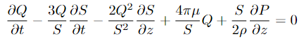

# Hemodynamics Mathematical Model

This project explores the mathematical modeling of blood flow (hemodynamics) in the human circulatory system, using principles from fluid dynamics. It aims to model the dynamics of blood flow through vessels, leveraging the Navier-Stokes equations and developing an approach to solve them both analytically and numerically.

## Project Overview

The main objectives of this project are:

- **Introduction to Hemodynamics**: Discussing the increasing prevalence of cardiovascular diseases and the role of mathematical models in predicting the outcomes of surgical operations in cardiology.
- **Mathematical Modeling**:
  - The model begins with Navier-Stokes equations, describing the motion of blood as a fluid through vessels.
  - Various parameters such as blood density, pressure, and flow velocity are taken into account.
- **Derivation of Blood Flow Equation**: Using approximations and assumptions to simplify the Navier-Stokes equations into a form suitable for solving the flow and pressure of blood within arteries.
- **Flow and Pressure Models**:
  - Derivation of equations for blood flow ($Q$), cross-sectional area of the vessel ($S$), and blood pressure ($P$) within arteries over time and distance.
  - These equations are then used to simulate real-world blood flow and pressure dynamics under different conditions.

## The Key Derived Equation
- **Blood Flow Equation**:

   

       
   

Where:

- $Q(z,t)$: Blood flow rate
- $S(z,t)$: Cross-sectional area of the vessel
- $P(z,t)$: Blood pressure
- $\rho$: Blood density
- $\mu$: Blood viscosity

## Tools and Libraries

The project was implemented in Python using Jupyter Notebook. The following libraries were used:

- `numpy`: For numerical computations
- `matplotlib`: For plotting graphs and visualizing results
- `numba`: For high-performance numerical computations and optimizing Python functions with JIT (Just-In-Time) compilation.

## Conclusion

This project provides an in-depth look into the mathematical modeling of blood flow in the circulatory system. By solving these equations, it becomes possible to predict how blood moves through vessels under various physiological conditions, which can assist in diagnosing and treating cardiovascular diseases.