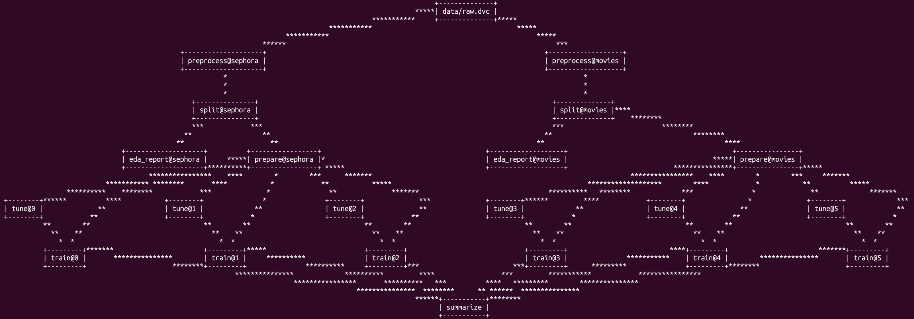

# Sentiment Analysis Pipeline

This project implements a reproducible sentiment classification pipeline using DVC and Docker. It compares multiple machine learning models (Random Forest, SVM, Dummy) trained on two datasets:

- **Sephora Products and Skincare Reviews**,  
- **Movie Reviews**.

The pipeline covers preprocessing, data splitting, text vectorization, model training with hyperparameter tuning, and final evaluation. For text vectorization, it supports several methods:

- **Bag of Words**  
- **TF-IDF**  
- **Word2Vec embeddings**

These options, among others, are configurable via `params.yaml`, allowing experimentation with both classical and embedding-based approaches. The primary goal of this project is to ensure full reproducibility of the sentiment analysis workflow by leveraging tools like DVC and Docker, while supporting a flexible framework for experimenting with different text processing and classification techniques.


# Project Reproducibility Instructions with Docker and DVC

## Prerequisites

- Docker installed  
- Git installed  
- Access to the project repository

The project includes a `Makefile` to simplify Docker usage.

## Project Structure

#### **Key components of the project:**

- `data/raw/` — contains the original, raw input datasets downloaded manually.
- `data/movies_eda_output.ipynb` and `data/sephora_eda_output.ipynb` — Jupyter notebooks with minimalistic exploratory data analysis (EDA) reports generated for each dataset.
- `results_hp_tuning/` — stores outputs of hyperparameter tuning for various models.
- `results_final/` — contains final evaluation metrics and model performance results.
- `scripts/` — Python scripts for pipeline elements.
- `src/` — core modules and utilities used by the pipeline (e.g., text cleaning and vectorization).
- `dvc.yaml` — the main DVC pipeline configuration file defining stages and dependencies.
- `params.yaml` — configuration file for various stages.
- `Dockerfile` and `Makefile` — support containerized environment setup and simplify running pipeline commands.

#### **Supplementary notebooks:**

Additionally, outside of the main pipeline, the repository also includes two additional Jupyter notebooks, found in `supplementary_notebooks/`, which are not part of the main DVC pipeline. They provide complementary analysis for Sephora dataset, based on a related project:

- `eda_sephora_advanced.ipynb` – a more detailed exploratory data analysis (EDA), including manual feature engineering.
- `explain_rf_sephora.ipynb` – model explainability for a Random Forest classifier trained on enriched features.

These notebooks may be helpful for deeper insight into the dataset, but are **not required to reproduce the pipeline results**. They provide valuable insights and are highly recommended if you wish to explore the dataset or model explanations more thoroughly.


## Steps to Reproduce Results

### 1. **Clone the Project Repository**

After cloning, navigate to the project's root directory:
```bash
git clone <repo-url>
cd <repo-name>
```
### 2. **Datasets**

This project uses two datasets:

- **Sephora Products and Skincare Reviews**:  
    - Dataset [https://www.kaggle.com/datasets/nadyinky/sephora-products-and-skincare-reviews](https://www.kaggle.com/datasets/nadyinky/sephora-products-and-skincare-reviews)

- **Movie Reviews** (Cornell):  
    - Dataset [http://www.cs.cornell.edu/people/pabo/movie-review-data/rt-polaritydata.tar.gz](http://www.cs.cornell.edu/people/pabo/movie-review-data/rt-polaritydata.tar.gz)
    - Documentation [http://www.cs.cornell.edu/people/pabo/movie-review-data/](http://www.cs.cornell.edu/people/pabo/movie-review-data/)


Please download and extract these datasets manually before proceeding with the next steps.


### 3. **Prepare Input Data**

Place the required files for both datasets in the folders *`data/raw/movies`* and *`data/raw/sephora`* as shown below:

```
├── 📂 data
    ├── 📁 raw
        ├── 📁 movies
        │   ├── rt-polarity.neg
        │   └── rt-polarity.pos
        └── 📁 sephora
            ├── product_info.csv
            ├── reviews_0-250.csv
            ├── reviews_250-500.csv
            ├── reviews_500-750.csv
            ├── reviews_750-1250.csv
            └── reviews_1250-end.csv
```

*Note: This project does not use a DVC remote. Data must be added manually.*

### 4. **Build the Docker Image**

Use the provided Dockerfile and Makefile to build the image:

```bash
make build
```

### 5. **Run the Docker Container**

Start the container with an interactive session:

```bash
make run_docker_dvc
```

### 6. **Run the Data Processing Pipeline**  
Inside the container, execute:
   ```bash
   dvc repro
   ```

### 7. **(Optional) Visualize Pipeline Dependencies**  
To visualize the DAG (Directed Acyclic Graph) of pipeline stages:
   ```bash
   dvc dag
   ```
Result of this command is presented below:



